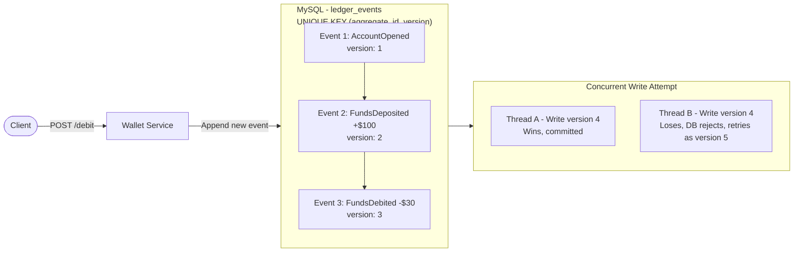

# Initial



### <u>Ledger Events</u>

- Long id
- String aggrerateId<br>
- Integer version<br>
- String eventType<br>
- Event payload<br>
- LocalDataTime createdAt<br>
- String traceId

### <u> Service Methods</u>

- appendEvents()
- getEvents()
- getEventsAfterVersion()
- getCurrentVersion()

### <u>Exception handling</u>

#### Types

- EventAlreadyExists
- EventNotFound

#### Methods

- GlobalExceptionHandler
- ErrorResponse(for sending statusCode,message)

### <u> Controller</u>

##### WalletController

- /addEvent
- /findById/{aggregateId}
- /findEventAfterVersion/{aggregateId}/{version}
- /currentVersion/{aggregateId}
### <u>Postman Test Sequence</u>

#### Test 1 — Create first event (should succeed, 201)
- POST http://localhost:8080/api/event/addEvent
- Content-Type: application/json<br>
  {<br>
  "aggregateId": "ACC100",<br>
  "version": 0,<br>
  "eventType": "AccountOpened",<br>
  "payload": { "type": "MoneyCredited", "amount": 0, "reason": "Account opened" },<br>
  "traceId": "trace-001"<br>
  }
  <br>
- Expect: 201 Created, response body has "version": 1.

#### Test 2 — Deposit $100 (should succeed, 201)
- POST http://localhost:8080/api/event/addEvent
- Content-Type: application/json<br>
  {<br>
  "aggregateId": "ACC100",<br>
  "version": 1,<br>
  "eventType": "MoneyCredited",<br>
  "payload": { "type": "MoneyCredited", "amount": 100.00, "reason": "Initial deposit" },<br>
  "traceId": "trace-002"<br>
  }
  <br>
- Expect: 201 Created, "version": 2.

#### Test 3 — Debit $30 (should succeed, 201)
- POST http://localhost:8080/api/event/addEvent
- Content-Type: application/json<br>
  {<br>
  "aggregateId": "ACC100",<br>
  "version": 2,<br>
  "eventType": "MoneyDebited",<br>
  "payload": { "type": "MoneyDebited", "amount": 30.00, "reason": "Transfer to ACC200" },<br>
  "traceId": "trace-003"<br>
  }
  <br>
- Expect: 201 Created, "version": 3.

#### Test 4 — Duplicate version conflict (should FAIL, 409)
- Send Test 3 again with the same version: 2
- POST http://localhost:8080/api/event/addEvent
- Content-Type: application/json<br>
  {<br>
  "aggregateId": "ACC100",<br>
  "version": 2,<br>
  "eventType": "MoneyDebited",<br>
  "payload": { "type": "MoneyDebited", "amount": 30.00, "reason": "duplicate attempt" },<br>
  "traceId": "trace-004"<br>
  }
  <br>
- Expect: 409 Conflict — this is your optimistic concurrency check actually firing. If you get 201 instead, something's wrong with the check.

#### Test 5 — Get all events for ACC100
- GET http://localhost:8080/api/event/findById/ACC100
- Expect: array of 3 events, in version order (1, 2, 3), each with correct payload type.

#### Test 6 — Get current version
- GET http://localhost:8080/api/event/currentVersion/ACC100
- Expect: 3

#### Test 7 — Get events after version 1 (should return only v2, v3)
- GET http://localhost:8080/api/event/findEventAfterVersion/ACC100/1
- Expect: array of 2 events (versions 2 and 3) — this is your snapshot-replay pattern in action.

#### Test 8 — Nonexistent account
- GET http://localhost:8080/api/event/currentVersion/ACC999
- Expect: 0 (no events yet, falls into .orElse(0)).

---

## Unit Tests — WalletServiceImplementation

### Test file location

`WalletService/src/test/java/com/wallet_service/WalletService/service/WalletServiceImplementationTest.java`

### What is being tested

`WalletServiceImplementation` has one dependency: `WalletRepository` (mocked — no real DB).

Pattern: `@Mock WalletRepository` + `@InjectMocks WalletServiceImplementation`

---

### appendEvent()

Logic:
- Calculates `nextVersion = event.getVersion() + 1`
- If `nextVersion` slot already exists in DB → throws `EventAlreadyExists`
- Otherwise → saves new event → returns saved event

Tests written:

| Test | Condition | Expected |
|---|---|---|
| Happy path | Version slot is free | Saved event returned, `save()` called once |
| Conflict | Version slot already taken | `EventAlreadyExists` thrown, `save()` never called |

---

### getEvents()

Logic:
- Calls `findByAggregateIdOrderByVersionAsc()`
- If list is empty → throws `EventNotFound`
- Otherwise → returns list

Tests written:

| Test | Condition | Expected |
|---|---|---|
| Happy path | Events exist | List returned in version order |
| Not found | No events exist | `EventNotFound` thrown |

---

### getEventsAfterVersion()

Logic:
- Calls `findByAggregateIdAndVersionGreaterThan...(aggregateId, afterVersion)`
- If list is empty → throws `EventNotFound`
- Otherwise → returns list

Use case: snapshot-replay pattern — load events after snapshot version N without replaying full history.

Tests written:

| Test | Condition | Expected |
|---|---|---|
| Happy path | Events exist after version | Events v2, v3 returned |
| Not found | No events after version | `EventNotFound` thrown with aggregateId and version in message |

---

### getCurrentVersion()

Logic:
- Calls `findFirstByAggregateIdOrderByVersionDesc()` → maps to version number → `orElse(0)`
- If version is 0 (nothing found) → throws `EventNotFound`
- Otherwise → returns version integer

Tests written:

| Test | Condition | Expected |
|---|---|---|
| Happy path | Events exist | Returns latest version (e.g. 3) |
| Not found | No events → `orElse(0)` → guard fires | `EventNotFound` thrown |

---

### New assertion learned: assertThatThrownBy

```java
assertThatThrownBy(() -> walletService.getEvents("ACC999"))
        .isInstanceOf(EventNotFound.class)
        .hasMessageContaining("ACC999");
```

Used when testing that a method throws an exception. If no exception is thrown, the test fails.