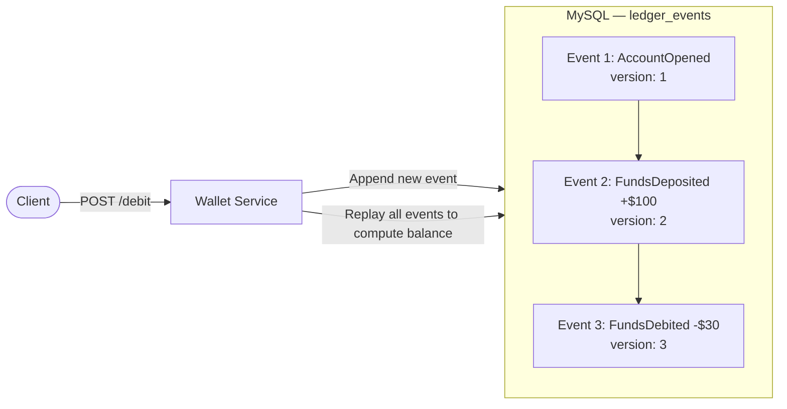

# Stage 1 — Event Store

## Problem
A CRUD-based wallet overwrites the balance on every transaction. There is no history — you can't prove what the balance was at any point in time, and you can't audit past transactions.

## Solution
Instead of updating a balance column, every financial action is appended as an immutable row to `ledger_events`. The current balance is computed by replaying all events in order.

## Architecture

## What was built

**Entity — `LedgerEvents`**
| Column | Type | Notes |
|---|---|---|
| `id` | `BIGINT` | Auto-increment PK |
| `aggregate_id` | `VARCHAR(64)` | Account identifier |
| `version` | `INT` | Event sequence number |
| `event_type` | `VARCHAR(100)` | e.g. `AccountOpened`, `MoneyCredited` |
| `payload` | `JSON` | Polymorphic — `MoneyCredited` or `MoneyDebited` |
| `created_at` | `TIMESTAMP(6)` | Set on insert via `@PrePersist` |
| `trace_id` | `VARCHAR(64)` | Optional correlation ID |

**Event types (`payload` polymorphism)**
- `MoneyCredited` — adds to balance
- `MoneyDebited` — subtracts from balance

**`EventStore` interface**
- `appendEvent(LedgerEvents)` — writes next event
- `getEvents(aggregateId)` — returns full history in version order
- `getEventsAfterVersion(aggregateId, version)` — returns delta after a given version
- `getCurrentVersion(aggregateId)` — returns latest version number
- `getBalance(aggregateId)` — computes current balance from event history

**`BalanceCalculator`**
Replays the event list using a `switch` on payload type — credits add, debits subtract.

**`WalletController` — `/api/event`**
| Method | Path | Action |
|---|---|---|
| POST | `/addEvent` | Append a new event |
| GET | `/findById/{aggregateId}` | Get full event history |
| GET | `/findEventAfterVersion/{aggregateId}/{version}` | Get delta after version |
| GET | `/currentVersion/{aggregateId}` | Get latest version number |

## Limitation
Two concurrent requests can both read the same event history, both compute `version 4`, and both try to insert it. The later write silently overwrites the first — **double-spend possible**.
