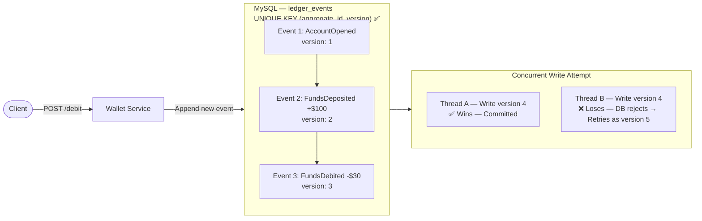

# Stage 2 — Concurrency Versioning

## Problem
Two concurrent requests both read event history before either writes. Both compute `version 4` and insert simultaneously — both succeed. The second write silently overwrites the first, allowing a double-spend.

## Solution
A `UNIQUE KEY (aggregate_id, version)` constraint on `ledger_events`. Only one thread can commit a given version number. The loser gets a conflict exception and retries by re-reading history and attempting the next version.

## Architecture



## What was built

**`LedgerEvents` entity — unique constraint**
```java
@Table(
    uniqueConstraints = {
        @UniqueConstraint(
            name = "uq_aggregate_version",
            columnNames = {"aggregate_id", "version"}
        )
    }
)
```

**`appendEvent()` — conflict check before insert**

`WalletServiceImplementation` pre-checks version existence before calling `save()`:
```java
Integer nextVersion = event.getVersion() + 1;
if (walletRepository.existsByAggregateIdAndVersion(event.getAggregateId(), nextVersion)) {
    throw new EventAlreadyExists("Version " + nextVersion + " already exists...");
}
```

**`WalletRepository` queries**
- `existsByAggregateIdAndVersion(aggregateId, version)` — conflict guard
- `findByAggregateIdOrderByVersionAsc(aggregateId)` — ordered replay
- `findByAggregateIdAndVersionGreaterThanOrderByVersionAsc(aggregateId, version)` — delta fetch
- `findFirstByAggregateIdOrderByVersionDesc(aggregateId)` — current version lookup

**Exception handling**
- `EventAlreadyExists` → `409 Conflict`
- `EventNotFound` → `404 Not Found`
- `GlobalExceptionHandler` maps both to `ErrorResponse`

## Limitation
If an account has 10,000 events, every balance check replays all 10,000 from scratch — catastrophic latency at scale.
