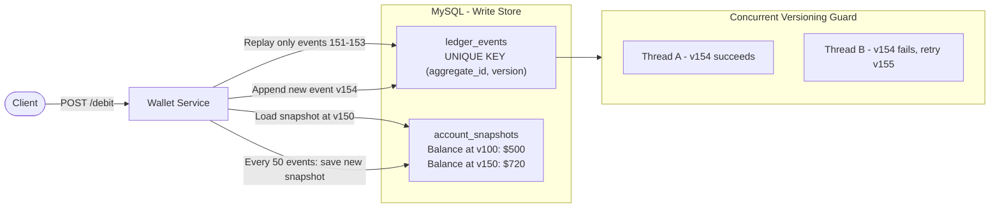

# Stage 3 — Snapshotting

## Problem

Every balance read replays the full event history from version 1. As event count grows, this becomes a full table scan per request — unacceptable latency.

## Solution

Persist a periodic snapshot of the computed balance. On the next read, load the nearest snapshot and only replay the small delta of events since then — instead of replaying from the beginning.

## Architecture



## What was built

**Entity — `AccountSnapshots`**


| Column         | Type            | Notes                               |
| -------------- | --------------- | ----------------------------------- |
| `aggregate_id` | `VARCHAR(64)`   | PK — one snapshot row per account  |
| `version`      | `INT`           | Version at which snapshot was taken |
| `balance`      | `DECIMAL(18,4)` | Computed balance at that version    |
| `updated_at`   | `TIMESTAMP(6)`  | Auto-updated on every upsert        |

**`SnapshotRepository`**
- `findFirstByAggregateIdOrderByVersionDesc(aggregateId)` — loads the most recent snapshot for an account

**50-event threshold trigger — `appendEvent()`**
Every time `nextVersion % 50 == 0`, a snapshot is written alongside the new event:
```java
if (nextVersion % 50 == 0) {
    BigDecimal previousBalance = getBalance(event.getAggregateId());
    BigDecimal eventImpact = BalanceCalculator.calculateBalance(List.of(newEvent));
    BigDecimal currentBalance = previousBalance.add(eventImpact);
    snapshotRepository.save(new AccountSnapshots(aggregateId, nextVersion, currentBalance));
}
```

**`getBalance()` — snapshot-aware balance calculation**
- No snapshot → calls `getEvents()` and replays the full history
- Snapshot exists → loads snapshot balance + replays only the delta events after snapshot version

**Note:** `getBalance()` exists in the service but is not yet exposed as a REST endpoint in `WalletController`.

## Limitation

Every balance read still hits disk on every request. Under load, all service replicas independently recalculate from the snapshot — redundant DB reads. An in-memory cache layer is needed.
