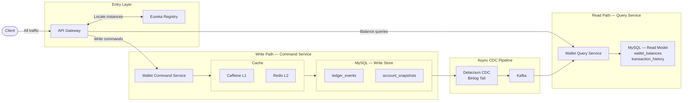

# Stage 5 — API Gateway, CQRS + CDC

## Problem

All client traffic was hitting the same monolith service — reads and writes competing for the same database, same threads, same everything. A high-volume balance check could starve a critical debit operation. There was no routing layer, no service discovery, and no way to scale reads and writes independently.

## Solution

Split the monolith into two services with completely separate responsibilities and separate databases:
- **Command Service** — only writes. Appends events, triggers snapshots, manages the write-side cache.
- **Query Service** — only reads. Serves balance lookups and transaction history from a denormalized read model.

Debezium CDC tails the MySQL binlog and pushes every committed event to Kafka. The Query Service consumes those CDC events and projects them into `wallet_balances` and `transaction_history` tables. No direct communication between the services — the database is the contract, Kafka is the bridge.

An API Gateway sits in front as the single entry point, and Eureka handles service discovery so the gateway can route to healthy instances dynamically.

## Architecture

## What was built

**API Gateway**
- Netty/WebFlux reactive gateway — non-blocking, handles thousands of concurrent connections with a handful of threads.
- Routes `/api/event/**` → `command-service` and `/api/accounts/**` → `query-service` via Eureka load-balanced URIs (`lb://`).
- No JWT auth — this is an internal ledger engine, not a user-facing app. Auth lives upstream.

**Eureka Server**
- All three services (gateway, command, query) register with Eureka and discover each other dynamically.

**Command Service (port 8081)**
- Kept the full write path from Stages 1–4: event append with concurrency guard, snapshotting every 50 events, Caffeine L1 + Redis L2 cache with Pub/Sub invalidation.
- Stripped out all read endpoints that don't belong on the write side. The only endpoint is `POST /api/event/addEvent`.

**CDC Pipeline**
- Debezium tails the MySQL binlog on `ledger_write_db.ledger_events`.
- Publishes to Kafka topic `wallet.ledger_write_db.ledger_events`.
- Connector config uses `EnvVarConfigProvider` so the DB password is injected via `${env:DEBEZIUM_PASSWORD}` — never hardcoded.

**Query Service (port 8082)**
- `EventConsumerService` — `@KafkaListener` that receives CDC events from Debezium.
- `ReadModelProjector` — parses the CDC payload, upserts `wallet_balances` (with `last_event_version` guard to skip duplicates), inserts `transaction_history`.
- `QueryServiceImplementation` — serves balance lookups through Caffeine L1 → Redis L2 → DB fallback chain.
- `CacheInvalidationListner` — subscribes to Redis Pub/Sub so when one replica processes a CDC event and invalidates its cache, all other replicas evict their stale L1 entries too.

**Read Model — `wallet_balances`**

| Column | Type | Notes |
|---|---|---|
| `account_id` | `VARCHAR(64)` | PK |
| `balance` | `DECIMAL(18,4)` | Current computed balance |
| `last_event_version` | `INT` | Idempotency guard — skip events already processed |
| `last_updated_at` | `TIMESTAMP` | Auto-updated |

**Read Model — `transaction_history`**

| Column | Type | Notes |
|---|---|---|
| `transaction_id` | `VARCHAR(64)` | PK (trace_id from the event) |
| `account_id` | `VARCHAR(64)` | Indexed with timestamp for pagination |
| `type` | `VARCHAR(20)` | MoneyCredited / MoneyDebited |
| `amount` | `DECIMAL(18,4)` | Transaction amount |
| `balance_after` | `DECIMAL(18,4)` | Running balance after this transaction |
| `timestamp` | `TIMESTAMP(6)` | When the original event was created |

**Query Controller — `/api/accounts`**

| Method | Path | Action |
|---|---|---|
| GET | `/getBalance/{accountId}` | Returns current balance (L1 → L2 → DB) |
| GET | `/getTransactionHistory/{accountId}?page=0&size=10` | Paginated transaction history, newest first |

**Docker Compose**
- 8 services on one network: MySQL, Eureka, API Gateway, Command Service, Query Service, Redis, Kafka + Zookeeper, Debezium.
- Proper `depends_on` with healthchecks so services start in the right order.
- All secrets come from `.env` (gitignored).

## Limitation

Kafka delivers messages asynchronously — if the consumer crashes after processing an event but before committing the offset, the event gets redelivered and processed again. Also, clients retrying timed-out HTTP requests can trigger the same transaction twice on the write side. Need partitioning with manual offset commits, and idempotency keys.
